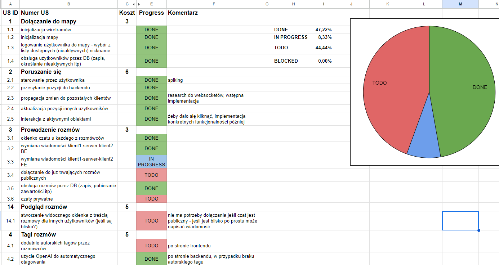
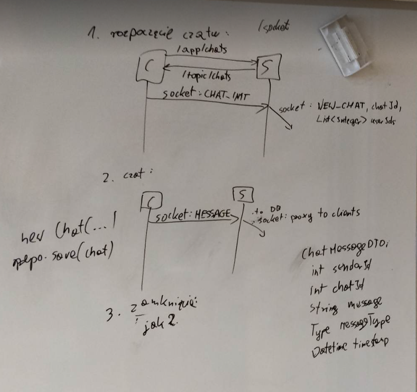
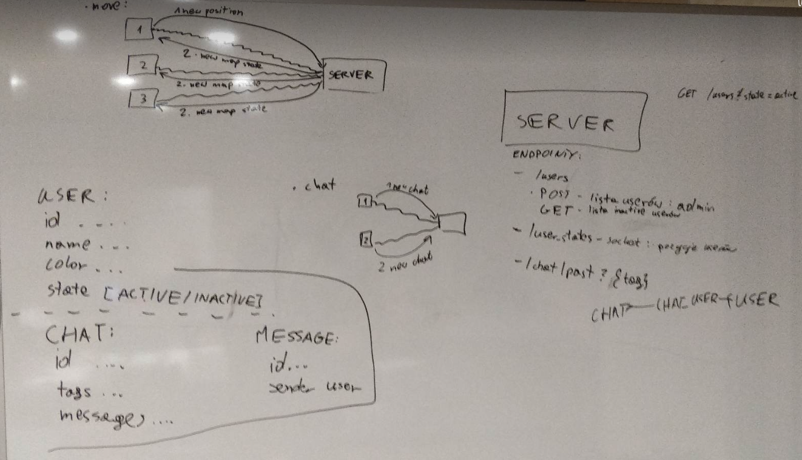
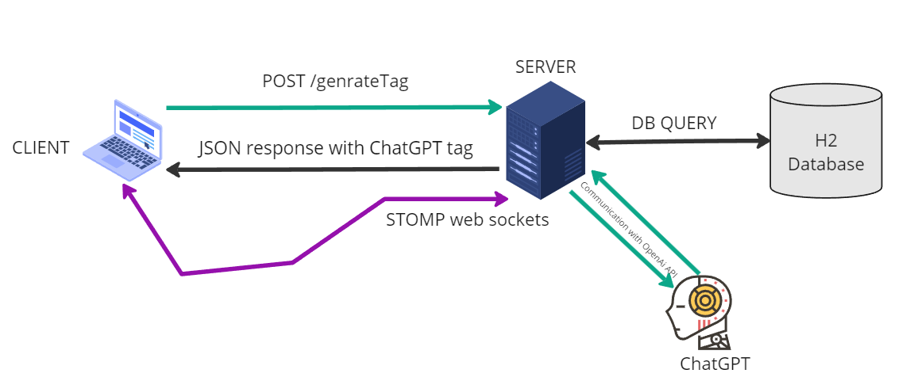

# Dokumentacja techniczna

Opis dokumentacji technicznej aplikacji **Virtual-Office** według wytycznych z MSTeams.

### Zastosowane technologie

* **Frontend** powstał we frameworku **React** i został napisany w języku **TypeScript**. W utrzymywaniu spójnego kodu pomagały wtyczki **Eslint** oraz **prettier**, choć ten drugi sprawiał pewne problemy. Wkomponowanie stylów umożliwiła biblioteka **styled-components**.
* **Backend** został w całości napisany we frameworku **Spring** i języku **Java**. 
* Komunikację między elementami zapewniły **RESTowe endpointy** oraz **web sockety** wykorzystujące protokół **STOMP** oraz bibliotekę **react-stomp-hooks**.
* Relacyjną bazę danych obsługiwał system **H2**.

### Elementy procesu

Podczas tworzenia aplikacji operowaliśmy w dosyć ekstremalnej wersji metodologii **SCRUM**.
Odbyliśmy 4 spotkania typu **daily** i jedną **retrospektywę**, a nasze User Stories podzieliliśmy na zadania i umieściliśmy na naszym **Kanban boardzie**:

W ramach procesu implementacji funkcjonalności **komunikacji między komponentami** oraz ustalania **typów danych** korzystaliśmy również z klasycznej tablicy.  
Oto część naszych notatek:

Komunikowanie pozycji awatarów oraz wiadomości czatu poprzez web sockety

Oraz typy danych i część RESTowych endpointów 

### Architektura Aplikacji
Aplikacja powstała w architekturze **klient-serwer**.  

Wyszczególnione są dwa typy użytkowników &rarr; **Admin** oraz **Pracownik**.

**Flow działania aplikacji**:  
1. Admin tworzy konta dla nowych użytkowników
2. Pracownik loguje się do aplikacji poprzez wybór jednego z nickname'ów. Dzięki komunikacji z serwerem dostępne są tylko niezalogowane avatary
3. Podczas przebywania w wirtualnym biurze może on poruszać się po jego reprezentacji i obserwować ruchy innych zalogowanych współpracowników
4. Każdy avatar posiada **status** widoczny dla innych użytkowników, który może zmieniać, gdy tylko nie jest związany rozmową lub nie przegląda archiwum
5. \* Gdy dwa awatary znajdą się obok siebie, mogą nawiązać ze sobą rozmowę na **publicznym czacie**.
6. Użytkownik może zwrócić się do **chatuGPT** z prośbą o otagowanie jego rozmowy.
7. \* Każdy zakończony czat jest zapisywany w bazie danych i staje się dostępny do wglądu w archiwum.
8. Gdy użytkownik kończy pracę, wylogowuje się z aplikacji

* Punkty oznaczone * zostały odrębnie zaimplementowane zarówno po stronie backendu, jak i frontendu, jednak ostatecznie nie udało się ich połączyć.
* W punktach 1, 2, 4 oraz 6, 7 i 8 do komunikacji między komponentami wykorzystano **RESTowe** endpointy, natomiast w punktach 3 i 5 informacje były przekazywane w formacie **JSON** poprzez **web sockety**. 

Poniżej przedstawiono prosty schemat komponentów:  

